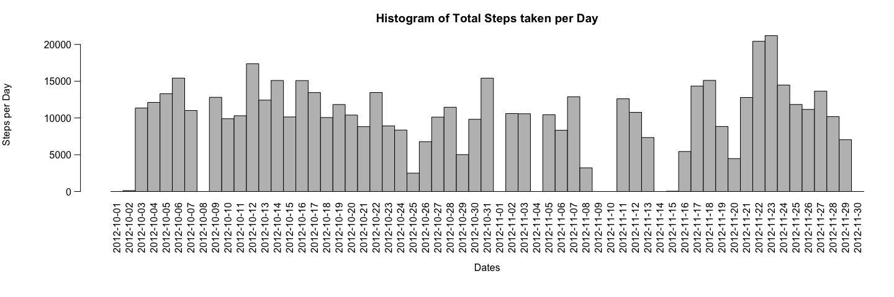
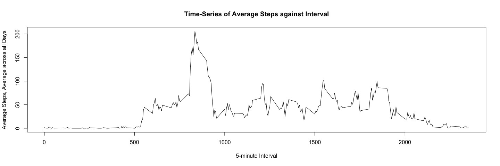
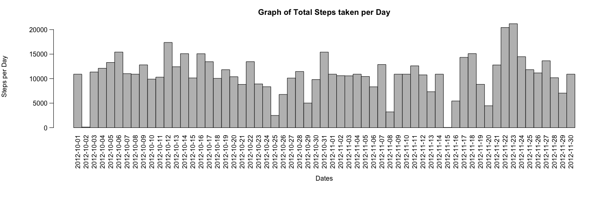
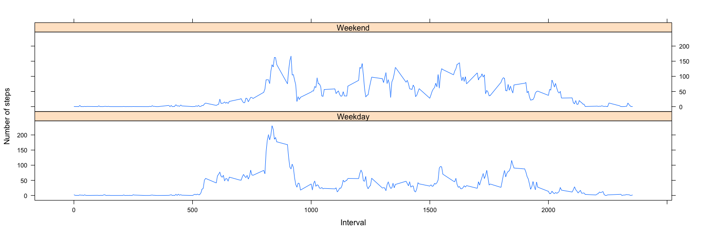

# Reproducible Research: Peer Assessment 1


## Loading and preprocessing the data
>Show any code that is needed to
 1. Load the data (i.e. read.csv())
 2. Process/transform the data (if necessary) into a format suitable for your analysis


```r
sourceData <- read.csv(unz("activity.zip", "activity.csv"))
#Process/transform the data (if necessary) into a format suitable for your analysis
sourceData$date <- as.Date(sourceData$date)
```

First rows on our source dataset:

```
##   steps       date interval
## 1    NA 2012-10-01        0
## 2    NA 2012-10-01        5
## 3    NA 2012-10-01       10
## 4    NA 2012-10-01       15
## 5    NA 2012-10-01       20
## 6    NA 2012-10-01       25
```

## What is mean total number of steps taken per day?
>For this part of the assignment, you can ignore the missing values in the dataset.
 1. Make a histogram of the total number of steps taken each day
 2. Calculate and report the mean and median total number of steps taken per day

To generate the overall mean of the total number of steps taken per day:

1. A dataset containing the total number of steps taken each day is created.


```r
dailyStepSum <- aggregate(x=sourceData$steps, by=list(sourceData$date), FUN=sum, na.rm=TRUE)
```
   Which generates:

```
##         Date Steps
## 1 2012-10-01     0
## 2 2012-10-02   126
## 3 2012-10-03 11352
## 4 2012-10-04 12116
## 5 2012-10-05 13294
## 6 2012-10-06 15420
```

2. A histogram is created for visual representation.


```r
with(dailyStepSum, {
    par(oma=c(2,0,0,0), mar=c(6.75,6.75,3,0), mgp=c(5.75,0.75,0), las=2)
    barplot(
      height=Steps,
      main="Histogram of Total Steps taken per Day",
      xlab="Dates",
      ylab="Steps per Day",
      names.arg=Date,
      space=c(0)
    )
})
```

 

3. Calculate the mean and median values (ignoring NA values) using the above dataset.

  1. Mean

```r
dailyStepMean <- mean(dailyStepSum$Steps, na.rm=TRUE)
```

```
## [1] 9354.23
```
  2. Median

```r
dailyStepMedian <- median(dailyStepSum$Steps, na.rm=TRUE)
```

```
## [1] 10395
```

## What is the average daily activity pattern?
>What is the average daily activity pattern?
 1. Make a time series plot (i.e. type = "l") of the 5-minute interval (x-axis) and the average number of steps taken, averaged across all days (y-axis)
 2. Which 5-minute interval, on average across all the days in the dataset, contains the maximum number of steps?

Now we need to find the mean steps taken for each 5-minute time interval averaged over all the days in the data:

1. Generate the mean (average) number of steps taken (ignoring NA values) for each 5-minute interval, itself averaged across all days.
  

```r
intervalSteps <- aggregate(
    data=sourceData,
    steps~interval,
    FUN=mean,
    na.action=na.omit
)
colnames(intervalSteps) <- c("Interval", "AvgStepsAvgAcrossDay")
```
   Which generates:

```
##   Interval AvgStepsAvgAcrossDay
## 1        0            1.7169811
## 2        5            0.3396226
## 3       10            0.1320755
## 4       15            0.1509434
## 5       20            0.0754717
## 6       25            2.0943396
```
  
2. A Time-Series plot is created from the above dataset


```r
with(intervalSteps, {
    plot(
      x=Interval,
      y=AvgStepsAvgAcrossDay,
      type="l",
      main="Time-Series of Average Steps against Interval",
      xlab="5-minute Interval",
      ylab="Average Steps, Average across all Days"        
    )
})
```

 
  
3. Finding the 5-minute interval with the maximum number of steps


```r
intervalMax <- intervalSteps[intervalSteps$AvgStepsAvgAcrossDay==max(intervalSteps$AvgStepsAvgAcrossDay),]
```

```
##     Interval AvgStepsAvgAcrossDay
## 104      835             206.1698
```
We conclude that interval **835** ..  **840** (minutes) has the maximum number of steps.


## Imputing missing values
>Note that there are a number of days/intervals where there are missing values (coded as NA). The presence of missing days may introduce bias into some calculations or summaries of the data.
 1. Calculate and report the total number of missing values in the dataset (i.e. the total number of rows with NAs)
 2. Devise a strategy for filling in all of the missing values in the dataset. The strategy does not need to be sophisticated. For example, you could use the mean/median for that day, or the mean for that 5-minute interval, etc.
 3. Create a new dataset that is equal to the original dataset but with the missing data filled in.
 4. Make a histogram of the total number of steps taken each day and Calculate and report the mean and median total number of steps taken per day. Do these values differ from the estimates from the first part of the assignment? What is the impact of imputing missing data on the estimates of the total daily number of steps?

Here we generate a new graph using the data of first section but with its NA values replaced.

To achieve this the mean 5-minunte interval values from the previous section will be used to replace the NA values.

1. Total number of rows with NA values in original data.


```r
countNA <- nrow(subset(sourceData, is.na(sourceData$steps)))
```

```
## [1] 2304
```

2. The average 5-minute interval values from the prevous section is used to replace the NA values of the original data and a new dataset will be generated from the latter.

 Decimal values will be rounded up to a whole number.
 

```r
stepValues <- data.frame(sourceData$steps)
stepValues[is.na(stepValues),] <- ceiling(tapply(X=sourceData$steps,INDEX=sourceData$interval,FUN=mean,na.rm=TRUE))
newData <- cbind(stepValues, sourceData[,2:3])
colnames(newData) <- c("Steps", "Date", "Interval")
```
  
  Which generates:

```
##   Steps       Date Interval
## 1     2 2012-10-01        0
## 2     1 2012-10-01        5
## 3     1 2012-10-01       10
## 4     1 2012-10-01       15
## 5     1 2012-10-01       20
## 6     3 2012-10-01       25
```

3. The total number of steps taken each day is generated using this new dataset.


```r
newDailyStepSum <- aggregate(newData$Steps, list(newData$Date), sum)
```
   Which generates:

```
##         Date Steps
## 1 2012-10-01 10909
## 2 2012-10-02   126
## 3 2012-10-03 11352
## 4 2012-10-04 12116
## 5 2012-10-05 13294
## 6 2012-10-06 15420
```

4. A histogram of this data as visual representation:


```r
with(newDailyStepSum, {
    par(oma=c(2,0,0,0), mar=c(6.75,6.75,3,0), mgp=c(5.75,0.75,0), las=2)
    barplot(
      height=Steps,
      main="Graph of Total Steps taken per Day",
      xlab="Dates",
      ylab="Steps per Day",
      names.arg=Date,
      space=c(0)
    )
})
```

 

5. Calculate the mean and median values of this new dataset (NA values replaced with mean).

  1. Mean

```r
newDailyStepMean <- mean(newDailyStepSum$Steps)
```

```
## [1] 10784.92
```
  2. Median

```r
newDailyStepMedian <- median(newDailyStepSum$Steps)
```

```
## [1] 10909
```
      
6. We conclude by observation that adding missing values to the original data has caused both the mean and median values to increase.

  1. Mean: 9354 to 10784
  2. Median: 10395 to 10909


## Are there differences in activity patterns between weekdays and weekends?
>For this part the weekdays() function may be of some help here. Use the dataset with the filled-in missing values for this part.
 1. Create a new factor variable in the dataset with two levels - "weekday" and "weekend" indicating whether a given date is a weekday or weekend day.
 2. Make a panel plot containing a time series plot (i.e. type = "l") of the 5-minute interval (x-axis) and the average number of steps taken, averaged across all weekday days or weekend days (y-axis). The plot should look something like the following, which was creating using simulated data:

1.  New factor indicating if date is a weekday/weekend is added to dataset created in the previous section.


```r
newDataWithDayType <- newData
newDataWithDayType$DayType <- as.factor(ifelse(weekdays(newData$Date) %in% c("Saturday","Sunday"), "Weekend", "Weekday"))
```
  
  Which generates:

```
##   Steps       Date Interval DayType
## 1     2 2012-10-01        0 Weekday
## 2     1 2012-10-01        5 Weekday
## 3     1 2012-10-01       10 Weekday
## 4     1 2012-10-01       15 Weekday
## 5     1 2012-10-01       20 Weekday
## 6     3 2012-10-01       25 Weekday
```
2. The data is then separated into weekday or weekend and the mean number of steps taken for each 5-minute interval, itself averaged across all weekday days or weekend days is calculated.


```r
dayTypeIntervalSteps <- aggregate(
    data=newDataWithDayType,
    Steps ~ DayType + Interval,
    FUN=mean
)
```
   Which generates:

```
##   DayType Interval     Steps
## 1 Weekday        0 2.2888889
## 2 Weekend        0 0.2500000
## 3 Weekday        5 0.5333333
## 4 Weekend        5 0.1250000
## 5 Weekday       10 0.2888889
## 6 Weekend       10 0.1250000
```

3. Finally, a panel plot of both weekend and weekday graphs:


```r
library("lattice")
  
xyplot(
    type="l",
    data=dayTypeIntervalSteps,
    Steps ~ Interval | DayType,
    xlab="Interval",
    ylab="Number of steps",
    layout=c(1,2)
)
```

 
